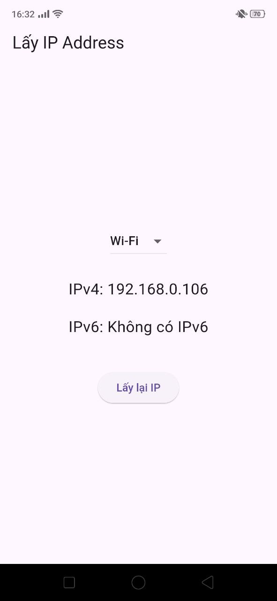
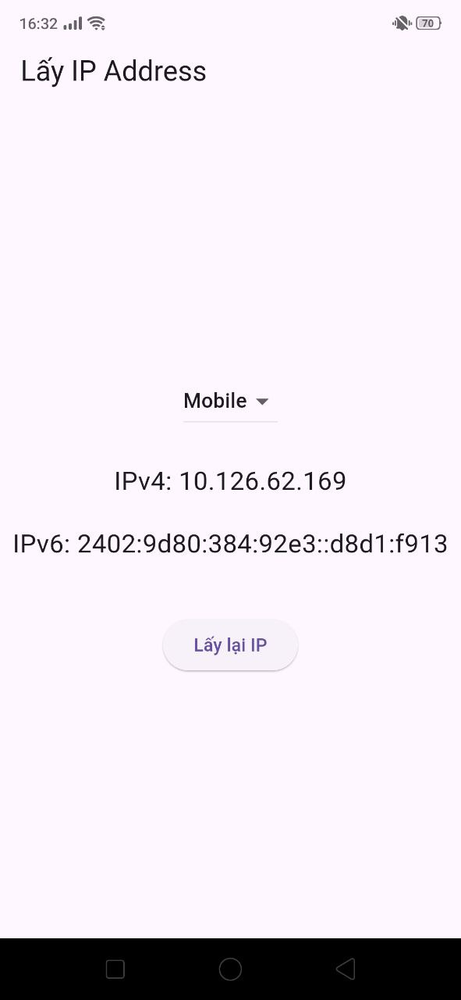
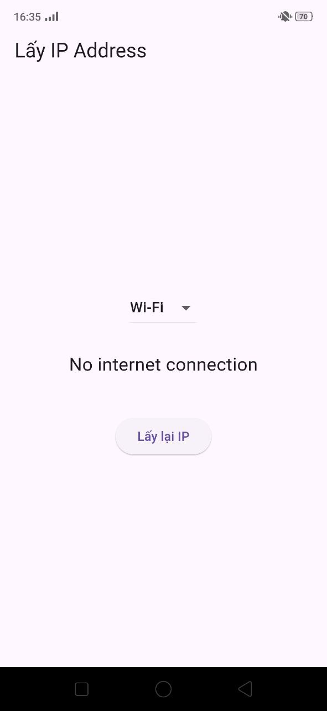

# ip_address_plugin

Plugin Flutter giúp lấy địa chỉ IP của thiết bị trên Android và iOS, hỗ trợ cả IPv4 và IPv6, cho phép chọn loại mạng (Wi‑Fi / Mobile Data), có cơ chế cache và xử lý đầy đủ các trường hợp mất kết nối.

## Tính năng

- **Lấy địa chỉ IP (IPv4 & IPv6)**  
  - Lấy địa chỉ IPv4 và IPv6 của thiết bị nếu khả dụng.  
  - Áp dụng cho cả Android và iOS.

- **Chọn loại mạng khi lấy IP**  
  - Cho phép người dùng chọn giữa:  
    - **Wi‑Fi**  
    - **Mobile Data (Cellular)**  
  - Nếu mạng được chọn không khả dụng, plugin sẽ trả về thông báo phù hợp.

- **Cơ chế cache để tránh gọi native dư thừa**  
  - Lưu lại kết quả IP lần gần nhất.  
  - Các lần gọi sau có thể dùng lại giá trị cache để:  
    - Giảm số lần gọi qua `MethodChannel` xuống native.  
    - Tối ưu hiệu năng và hạn chế giật lag khi gọi nhiều lần liên tục.

- **Xử lý ngoại lệ & trạng thái không có mạng**  
  - Khi thiết bị **offline** hoặc **không có kết nối mạng phù hợp**, plugin **không trả về `null`** mà trả về chuỗi:  
    - **"No internet connection"**  
  - Tránh crash và giúp UI dễ hiển thị trạng thái lỗi / cảnh báo người dùng.

## Kiến trúc & Thư viện sử dụng

- **Flutter plugin**  
  - Sử dụng `MethodChannel` để giao tiếp giữa Dart và native (Android/iOS).  
  - Lớp Dart đóng vai trò API chính, quản lý cache và điều phối loại mạng cần lấy IP.

- **Android (Kotlin/Java)**  
  - Sử dụng API mạng sẵn có của Android (ví dụ: `ConnectivityManager`, `NetworkCapabilities`, `InetAddress`, …) để:  
    - Lấy danh sách interface mạng hiện tại.  
    - Lọc theo loại mạng (Wi‑Fi / Mobile Data).  
    - Lấy ra IPv4 / IPv6 tương ứng.

- **iOS (Swift/Objective‑C)**  
  - Sử dụng các framework mạng của hệ thống (ví dụ: `Network` / `SystemConfiguration`) để:  
    - Lấy thông tin interface mạng.  
    - Lọc theo Wi‑Fi / Cellular.  
    - Lấy ra địa chỉ IPv4 / IPv6.

- **Caching ở tầng Dart**  
  - Lưu IP trả về kèm theo loại mạng.  
  - Chỉ gọi lại native khi:  
    - Không có cache, hoặc  
    - chủ động yêu cầu làm mới (refresh) từ phía Dart.

## Screenshots

| Wi‑Fi | Mobile Data | No internet connection |
|---|---|---|
|  |  |  |

## Hướng dẫn chạy

Plugin đi kèm một ứng dụng mẫu trong thư mục `example` để có thể test nhanh:

- **Bước 1**: Di chuyển vào thư mục example

cd example

- **Bước 2**: Cài đặt phụ thuộc

flutter pub get

- **Bước 3**: Chạy ứng dụng ví dụ

flutter run

Ứng dụng sẽ:

- Hiển thị nút / UI để chọn loại mạng (Wi‑Fi / Mobile Data).  
- Gọi plugin để lấy IPv4/IPv6.  
- Hiển thị chuỗi IP hoặc thông báo **"No internet connection"** nếu thiết bị không có mạng.

